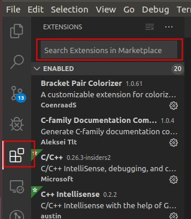
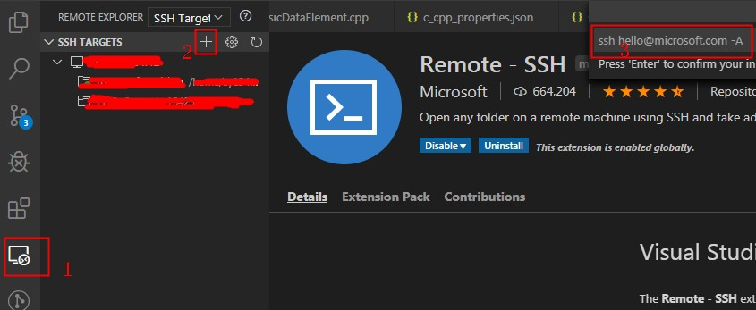
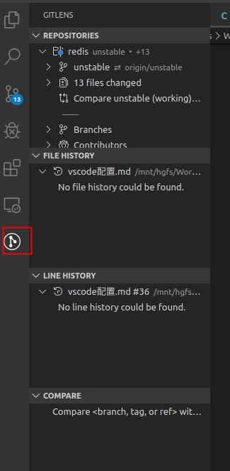
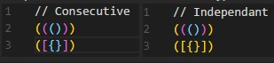
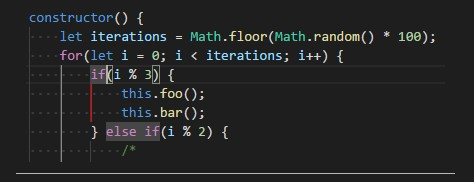
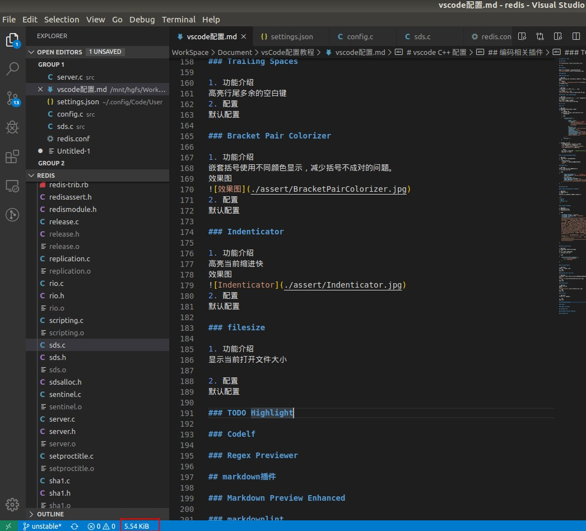

# vscode C++ 配置

## 下载安装

[下载地址](https://code.visualstudio.com/)

## 插件

### 安装方法

如下图，在插件管理中搜索安装对应的插件


### 管理类插件

#### Settings Sync

1. 功能介绍
云端同步vscode安装过的插件以及配置项，在一台新机器上就可以同步以前安装过的插件以及配置。
2. 配置教程
[参见"VSCode 使用Settings Sync同步配置"](https://www.cnblogs.com/moshuying/p/11348634.html)

### Remote - SSH

1. 功能介绍
链接远程服务器，在服务器上进行开发。
2. 配置教程
按下图编号顺序进行配置


### GitLens — Git supercharged

1. 功能介绍
git版本管理插件，可以显示每一行是那一次提交以及修改记录
2. 配置教程
默认配置，插件功能位置如下


## C++插件

### C/C++

1. 功能介绍
C++代码补全，调试，代码浏览功能
2. 工程配置
    * 配置文件位置
    工程目录下.vscode/c_cpp_properties.json
    * 配置文件内容

    ```JSON
    {
        "configurations": [
            {
                "name": "Linux",
                "includePath": [ # 添加头文件所在的目录
                    "${workspaceFolder}/**",
                    "/mnt/dev_ip31/prebuilts/rootfs_6.0/yunos6.0/rootfs4map"
                ],
                "defines": [],
                "compilerPath": "/usr/local/bin/gcc",
                "cStandard": "c11",
                "cppStandard": "c++17",
                "intelliSenseMode": "clang-x64",
                "configurationProvider": "vector-of-bool.cmake-tools",
                "compileCommands": "${workspaceFolder}/build/compile_commands.json"
            }
        ],
        "version": 4
    }
    ```

3. 静态代码检查配置
    * 需要生成compile_commands.json文件
    * 对于cmake工程，使用如下命令
    `cmake -DCMAKE_EXPORT_COMPILE_COMMANDS=1 ..`
    * 对于makefile工程，使用如下命令

    ```SHELL
    pip install compiledb   # 需要先安装compiledb工具
    compiledb -nf make
    ```

### C++ Intellisense（非必要）

1. 功能介绍
基于GNU Global tags的代码补全
2. 用法
    * 需要安装gtags
    * 在命令行执行如下命令生成TAGS文件
    `gtags`

### CMake Tools

1. 功能介绍
cmake 插件，build自动生成makefile
2. settings.json配置

```JSON
{
        "cmake.environment": {      # cmake中使用的环境变量
        "YUNOS_SYSROOTFS":"/mnt/dev_ip31/prebuilts/rootfs_6.0/yunos6.0/rootfs4map",
        "SOC_ARCH_NAME":"j6",
        "YUNOS_SUB_BUILD_PLATFORM":"j6",
        "YUNOS_COMPILER":"/mnt/dev_ip31/toolchain/gcc-linaro-arm-linux-gnueabihf-4.9-glibc-2.20"
    }
}
```

## 编码相关插件

### C-family Documentation Comments

1. 功能介绍
自动生成函数注释
2. 用法
输入/**，按回车。会自动生成类似如下注释

```C
/**
 * @brief
 * @note
 * @retval None
 */
```

### vscode-fileheader

1. 功能介绍
自动生成文件头介绍
2. setting.json配置

```JSON
{
    "fileheader.Author": "ShengYan",
    "fileheader.LastModifiedBy": "ShengYan",
    "fileheader.tpl": "/*\r\n * @Author: {author} \r\n * @Date: {createTime} \r\n * @Last Modified by:   {lastModifiedBy} \r\n * @Last Modified time: {updateTime} \r\n */\r\n",

}
```

### Path Intellisense

1. 功能介绍
自动补全系统中文件以及目录名称
2. 用法
必须在双引号中才可以补全
3. settings.json配置

```JSON
{
    "path-intellisense.mappings": {
        "/": "${workspaceRoot}",
        "~": "/home/shy"
    }
}
```

### Trailing Spaces

1. 功能介绍
高亮行尾多余的空白键
2. 配置
默认配置

### Bracket Pair Colorizer

1. 功能介绍
嵌套括号使用不同颜色显示，减少括号不成对的问题。
效果图

2. 配置
默认配置

### Indenticator

1. 功能介绍
高亮当前缩进快
效果图

2. 配置
默认配置

### filesize

1. 功能介绍
显示当前打开文件大小

2. 配置
默认配置

### TODO Highlight

1. 功能介绍
高亮，查找TODO，FIXME
2. settings.json配置

```JSON
{
    "todohighlight.isCaseSensitive": false,
    "todohighlight.include": [      # 查找的路径
        "**/*.js",
        "**/*.jsx",
        "**/*.ts",
        "**/*.tsx",
        "**/*.html",
        "**/*.php",
        "**/*.css",
        "**/*.scss",
        "**/*.cpp",
        "**/*.h",
        "**/*.hpp",
        "**/*.c"
    ],
}
```

### Codelf（变量命名神器）

1. 功能介绍
Best GitHub stars, repositories tagger and organizer. Search Github, GitLab to find real-world usage variable names.
2. 配置
默认

### Regex Previewer

1. 功能介绍
Regex matches previewer for JavaScript, TypeScript, PHP and Haxe in Visual Studio Code.
2. 配置
默认

## markdown插件

### Markdown Preview Enhanced

1. 功能介绍
markdown实时预览
2. 配置
默认

### markdownlint

1. 功能介绍
markdown语法分析
2. 配置
默认

## 个人settings.json配置

### 本地基本配置

```JSON
{
    "sync.gist": "*********",           # setting sync与github绑定后自动生成
    "files.autoSave": "afterDelay",
    "fileheader.Author": "ShengYan",
    "fileheader.LastModifiedBy": "ShengYan",
    "fileheader.tpl": "/*\r\n * @Author: {author} \r\n * @Date: {createTime} \r\n * @Last Modified by:   {lastModifiedBy} \r\n * @Last Modified time: {updateTime} \r\n */\r\n",
    "C_Cpp.updateChannel": "Insiders",

    "path-intellisense.mappings": {
        "/": "${workspaceRoot}",
        "~": "/home/shy"
    },

    "todohighlight.isEnable": true,
    "todohighlight.isCaseSensitive": false,
    "todohighlight.include": [
        "**/*.js",
        "**/*.jsx",
        "**/*.ts",
        "**/*.tsx",
        "**/*.html",
        "**/*.php",
        "**/*.css",
        "**/*.scss",
        "**/*.cpp",
        "**/*.h",
        "**/*.hpp",
        "**/*.c"
    ],
}
```

### 服务器环境变量配置

```JSON
{
    "terminal.integrated.env.linux": {
        "YUNOS_SYSROOTFS":"/mnt/dev_ip31/prebuilts/rootfs_6.0/yunos6.0/rootfs4map",
        "SOC_ARCH_NAME":"j6",
        "YUNOS_SUB_BUILD_PLATFORM":"j6",
        "YUNOS_COMPILER":"/mnt/dev_ip31/toolchain/gcc-linaro-arm-linux-gnueabihf-4.9-glibc-2.20"
    },
    "terminal.integrated.cwd": "/home/sy134235/workspace/map_caf2_addon/build",
}
```
